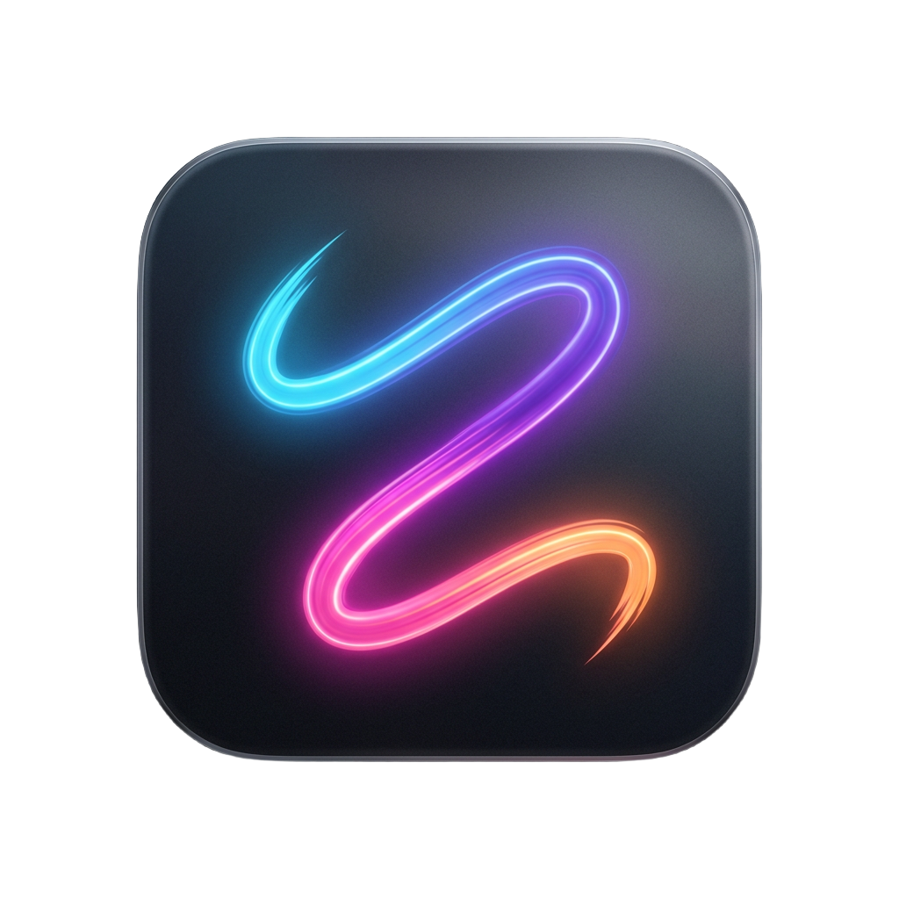

<div align="center">
  

  <h1>🖋️ FloatInk</h1>

  <p>
    <strong>A modern, sleek, and frictionless screen annotation tool exclusively for macOS.</strong>
  </p>

  <p>
    <a href="https://github.com/Chrisyii/FloatInk/releases/latest"></a>
    
    
    
    
  </p>

  <p>
    <a href="#-features">Features</a> •
    <a href="#-keyboard-shortcuts">Shortcuts</a> •
    <a href="#-installation">Installation</a> •
    <a href="#-development">Development</a> •
    <a href="#-license">License</a>
  </p>
</div>

<br />

> FloatInk is designed to be the ultimate presentation and tutorial companion. With a single keystroke, your entire screen becomes a canvas. Draw freely over any application flawlessly with zero lag.

<div align="center">
  <!-- TODO: Drop a beautiful screenshot of FloatInk in action right here! -->
<!--  -->
</div>

## ✨ Features

- **🎨 Draw Anywhere:** An invisible overlay sits on top of all your applications, allowing you to annotate freely over anything.
- **⚡ Blazing Fast:** Powered by Tauri (Rust + Webview), it utilizes incredibly little memory and sits quietly in the background.
- **💎 Glassmorphic UI:** A meticulously crafted, translucent floating toolbar that looks and feels native to macOS Sequoia.
- **🧰 Versatile Toolkit:** Includes a High-Precision Pen, Laser Pointer, Highlighter, Shapes (Arrows, Rectangles, Ellipses), and customizable Text inputs.
- **🛡️ Privacy First:** 100% offline, local, and privacy-respecting. No telemetry.

## ⌨️ Keyboard Shortcuts

FloatInk is built around pure speed. Use these shortcuts to seamlessly integrate it into your workflow:

| Global Shortcut | Action |
| --- | --- |
| `Cmd + Shift + D` | **Toggle the canvas** overlay on or off instantly across all spaces |
| `Esc` | Clear all drawings, exit text inputs, and close the overlay |
| `Cmd + Z` | Undo the last drawing stroke or action |
| `Cmd + Shift + Z` | Redo the last undone drawing stroke or action |

## 🚀 Installation

*Pre-compiled standalone `.app` and `.dmg` binaries will be available in the [Releases](https://github.com/Chrisyii/FloatInk/releases) section soon!*

For now, you can build FloatInk from source effortlessly.

## 💻 Development

FloatInk is built entirely with **Rust, HTML, CSS, and pure JS**, bundled securely using **Tauri**.

### Prerequisites

You will need the following installed on your machine:
1. [Node.js](https://nodejs.org/) (v16 or higher)
2. [Rust / Cargo](https://www.rust-lang.org/tools/install)
3. Follow the [Tauri macOS environment setup guide](https://tauri.app/v1/guides/getting-started/prerequisites#macos) if you haven't already.

### Getting Started

1. Clone the repository:
   ```bash
   git clone git@github.com:Chrisyii/FloatInk.git
   cd FloatInk
   ```

2. Install frontend dependencies:
   ```bash
   npm install
   ```

3. Run in development mode (with hot-module reloading):
   ```bash
   npm run dev
   ```

4. Build the release bundle (`.app` / `.dmg`):
   ```bash
   npm run build
   ```
   *The built app will be automatically located in `src-tauri/target/release/bundle/macos/FloatInk.app`.*

## 🤝 Contributing

Contributions are completely welcome! If you have ideas for new features, find a bug, or want to improve the codebase, feel free to open an Issue or submit a Pull Request.
1. Fork the project
2. Create your feature branch (`git checkout -b feature/AmazingFeature`)
3. Commit your changes (`git commit -m 'Add some AmazingFeature'`)
4. Push to the branch (`git push origin feature/AmazingFeature`)
5. Open a Pull Request!

## 📜 License

This project is open-sourced and distributed under the MIT License. See `LICENSE` for more information.

<p align="center">
  Made with ❤️ by <a href="https://github.com/Chrisyii">Chrisyii</a>
</p>
